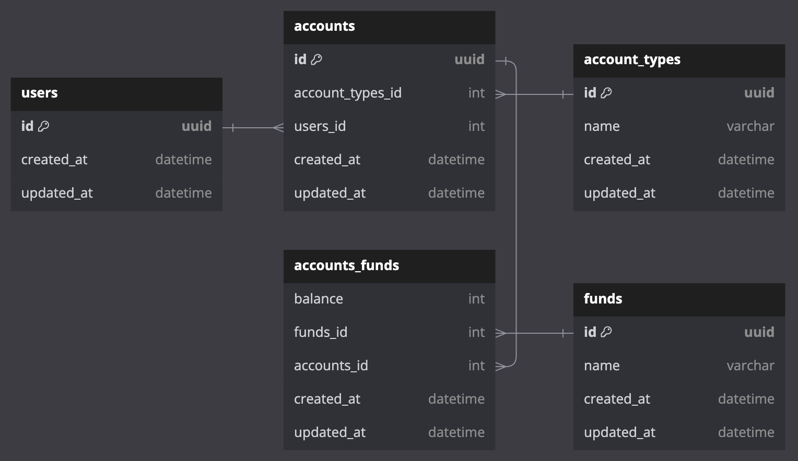

## Scenario

Cushon already offers ISAs and Pensions to Employees of Companies (Employers) who have an existing arrangement with Cushon. Cushon would like to be able to offer ISA investments to retail (direct) customers who are not associated with an employer. Cushon would like to keep the functionality for retail ISA customers separate from it’s Employer based offering where practical.
When customers invest into a Cushon ISA they should be able to select a single fund from a list of available options. Currently they will be restricted to selecting a single fund however in the future we would anticipate allowing selection of multiple options.
Once the customer’s selection has been made, they should also be able to provide details of the amount they would like to invest.
Given the customer has both made their selection and provided the amount the system should record these values and allow these details to be queried at a later date.
As a specific use case please consider a customer who wishes to deposit £25,000 into a Cushon ISA all into the Cushon Equities Fund.

## Assumptions

- Since the Direct Customer is selecting a Cushon ISA and a Cushon Equities Fund, it is assumed that these three entities already exist in the database.
- A relational database is being used.

## Implementation

### Entity Relationship Diagram

- Five tables will be created: users, accounts, accounts_type, funds and accounts_funds.
- Accounts will represent an investment which will have a one-to-many relationship with account_types in this case Cushon ISA.
- The funds table will represent the type of funds the user can choose from and in this case it represents the Cushon Equitites Fund.
- As accounts will have multiple funds in the future they will have many-to-many relationship so a accounts_funds will be the junction table.

  

### Project structure

- The root directory will have three directories: database, server and storage.
- Database directory will include the schemas and a seed file.
- Server will include the http handlers.
- Storage will have the storage struct, repository interface and the CRUD methods interacting with the database.
- SQLITE will be used to store the data.
- Database will be seeded with the user, accounts_type and funds_type.
